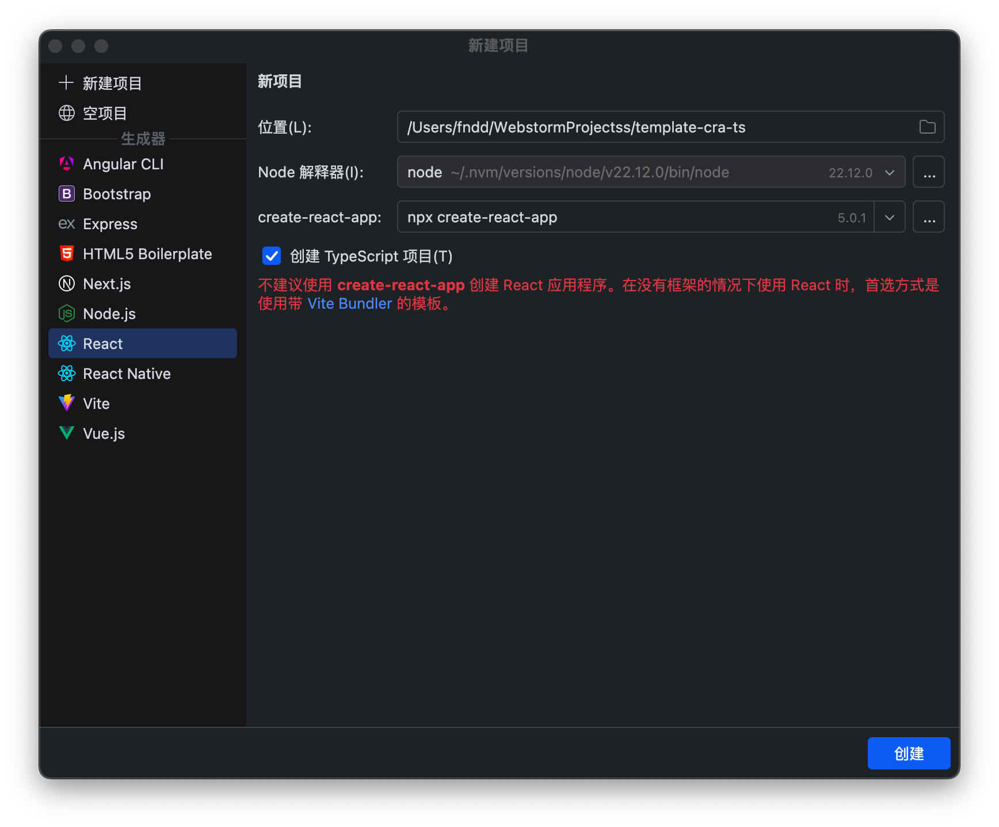

创建项目


下载依赖报错
```shell
/Users/fndd/.nvm/versions/node/v22.12.0/bin/npx --yes create-react-app@latest . --template typescript

Creating a new React app in /Users/fndd/WebstormProjectss/template-cra-ts.

Installing packages. This might take a couple of minutes.
Installing react, react-dom, and react-scripts with cra-template-typescript...


added 1320 packages in 7s

265 packages are looking for funding
  run `npm fund` for details

Initialized a git repository.

Installing template dependencies using npm...
npm error code ERESOLVE
npm error ERESOLVE unable to resolve dependency tree
npm error
npm error While resolving: template-cra-ts@0.1.0
npm error Found: react@19.0.0
npm error node_modules/react
npm error   react@"^19.0.0" from the root project
npm error
npm error Could not resolve dependency:
npm error peer react@"^18.0.0" from @testing-library/react@13.4.0
npm error node_modules/@testing-library/react
npm error   @testing-library/react@"^13.0.0" from the root project
npm error
npm error Fix the upstream dependency conflict, or retry
npm error this command with --force or --legacy-peer-deps
npm error to accept an incorrect (and potentially broken) dependency resolution.
npm error
npm error
npm error For a full report see:
npm error /Users/fndd/.npm/_logs/2024-12-20T06_55_39_618Z-eresolve-report.txt
npm error A complete log of this run can be found in: /Users/fndd/.npm/_logs/2024-12-20T06_55_39_618Z-debug-0.log
`npm install --no-audit --save @testing-library/jest-dom@^5.14.1 @testing-library/react@^13.0.0 @testing-library/user-event@^13.2.1 @types/jest@^27.0.1 @types/node@^16.7.13 @types/react@^18.0.0 @types/react-dom@^18.0.0 typescript@^4.4.2 web-vitals@^2.1.0` failed
Done
```

[2024-12-20T06_55_39_618Z-eresolve-report.txt](Z-README/2024-12-20T06_55_39_618Z-eresolve-report.txt)

[2024-12-20T06_55_39_618Z-debug-0.log](Z-README/2024-12-20T06_55_39_618Z-debug-0.log)

# Getting Started with Create React App

This project was bootstrapped with [Create React App](https://github.com/facebook/create-react-app).

## Available Scripts

In the project directory, you can run:

### `npm start`

Runs the app in the development mode.\
Open [http://localhost:3000](http://localhost:3000) to view it in the browser.

The page will reload if you make edits.\
You will also see any lint errors in the console.

### `npm test`

Launches the test runner in the interactive watch mode.\
See the section about [running tests](https://facebook.github.io/create-react-app/docs/running-tests) for more information.

### `npm run build`

Builds the app for production to the `build` folder.\
It correctly bundles React in production mode and optimizes the build for the best performance.

The build is minified and the filenames include the hashes.\
Your app is ready to be deployed!

See the section about [deployment](https://facebook.github.io/create-react-app/docs/deployment) for more information.

### `npm run eject`

**Note: this is a one-way operation. Once you `eject`, you can’t go back!**

If you aren’t satisfied with the build tool and configuration choices, you can `eject` at any time. This command will remove the single build dependency from your project.

Instead, it will copy all the configuration files and the transitive dependencies (webpack, Babel, ESLint, etc) right into your project so you have full control over them. All of the commands except `eject` will still work, but they will point to the copied scripts so you can tweak them. At this point you’re on your own.

You don’t have to ever use `eject`. The curated feature set is suitable for small and middle deployments, and you shouldn’t feel obligated to use this feature. However we understand that this tool wouldn’t be useful if you couldn’t customize it when you are ready for it.

## Learn More

You can learn more in the [Create React App documentation](https://facebook.github.io/create-react-app/docs/getting-started).

To learn React, check out the [React documentation](https://reactjs.org/).
